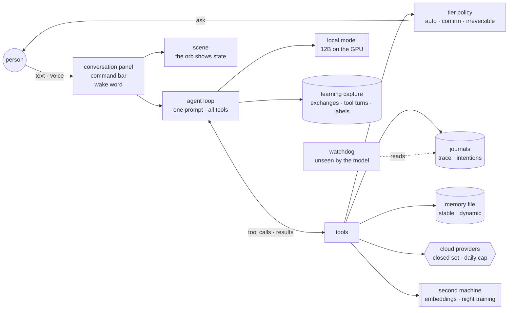

# A generic Kora — the shape, without the code

This page describes a Kora as something you could build with your own stack. It names the
components, what each one *holds* (the property it is responsible for), and what is
replaceable. The reference instance is Electron + TypeScript + Three.js + Ollama + SQLite; none
of that is the point.

## One picture

The person talks to the loop through three doors (panel, bar, wake word). The loop is single:
one system prompt, all capabilities as tools. Everything with a side effect passes through the
tier policy and leaves a line in the journals before it runs. The model is the requester
everywhere; the code is the judge.

## Components, and what each one holds

| Component | Holds | In the reference instance | Replaceable by |
|---|---|---|---|
| **Local model** | Answers and chooses tools; nothing else | `gemma4:12b` via Ollama, 32k context, temperature 0.3, thinking level per message | Any model that receives tool definitions intact (check `required`/`enum` survive your chat template) |
| **Agent loop** | "No final answer without the tool result"; round and time budgets; a Stop that reaches the HTTP request | One `runOrchestration()`; 8 rounds per call, 12 per turn, 120 s (×2 on deep thinking) | Any tool-calling loop with the same three budgets |
| **Tools** | Each capability as a real function with a typed schema | ~21: web search/read, file list/read/write in a sandbox, open/launch/media, delegate, memory write/update, recall past threads and provider answers, cleanup plan/execute | Your own — but every one goes in the policy table and the capability memo |
| **Tier policy** | Which tools run alone, ask, or are irreversible; sensitive-path escalation; per-path overrides (bar, voice) | One table; profiles per entry path | Same table, your paths |
| **Journals** | The record — the model's transcript is *not* the record | `orchestrator-trace.jsonl` (everything) + `kora-intentions.jsonl` (written before the confirmation is asked) | Any append-only log, two files, that ordering |
| **Memory** | A file the person can read and correct; a schema the model cannot escape; a visible signal per write | One Markdown file: stable portrait above a marker, four dynamic sections below, UUID per entry; re-read of quiet threads after 20 minutes | Same shape in any format the person will actually open |
| **Cloud delegation** | Closed provider set by use; context assembled by the app; answers persisted; daily cap | Claude / ChatGPT / DeepSeek; 6,000-char context; `delegation_results` table; $1/day + 100 search credits | Your providers, same four properties |
| **Voice** | Wake word trained on the person's voice; closed commands; STT/TTS local; barge-in | openWakeWord (+ speaker verifier), whisper.cpp on GPU, Piper | Any local stack — keep the closed commands and the frozen STT bench |
| **Second machine** | The always-on small model that must not evict the big one; night training | Raspberry Pi 4, bge-m3 resident; wake-word retraining at 3 a.m., promotion on numbers only | Any box on the LAN; the rule is the refusal to load it on the GPU |
| **Learning capture** | Every exchange and every tool turn kept with who answered; labels from gestures already made; the unjudged never exported | `fine_tune_log` + `tool_turn_log`; thumbs, corrections, confirmations as labels; SFT + preference exports; 15-minute QLoRA cycle | Any store — the properties are the point |
| **Scene** | The state, visible: thinking, speaking, writing memory, delegating, researching | An orb (volumetric), agents on Keplerian orbits, crystals for memory, arcs for cross-reading | Anything glanceable; a status bar would do |
| **Watchdog** | Counts calls, refusals, spend, repeats — and is absent from the prompt | Integrated monitor + panel | A cron and a log |
| **Capability memo** | The truth about what works, in the app: every capability with its status (`seen working` / `never re-checked` / `known limit`) and the function it serves; a test fails when a tool has no note | `capability-memo.ts` + a panel | A test that fails, whatever the file |

## The three functions

A Kora serves three functions that contradict each other pairwise, so it keeps three *paths*
rather than one prompt:

- **Research** — go and find sources that do not go together, read them across, and be allowed
  to say *nothing emerges*. Invention is forbidden.
- **Daily life** — files, mail, updates, music, weather, cleanup. An answer is required; the
  persona is one of rigour (no flattery, no smoothing of disagreement, short answers).
- **Play** — outfits it chooses itself, games built around it. Invention is allowed; the rigour
  persona is removed.

Each capability declares which function it serves; the compiler refuses one that serves none.
A *mode* ("Kora, research mode") narrows the tools to one function and changes the scene. Modes
are never persisted.

## The four learning loops

What a Kora learns, it learns from one person, and the data is produced by use:

| Loop | Data | Mechanism | Guard |
|---|---|---|---|
| Wake word | The person's own "Kora", recorded in the room | Nightly retraining on the second machine; candidate scored in shadow | Promotion only if four measured conditions pass; rejects kept |
| Command vocabulary | Phrases the person actually said | A sentence no closed command recognises is compared to said phrases; close enough → understood and learned | Far from everything → refused, never guessed |
| Model | Judged exchanges and tool turns; confirmations as labels | QLoRA on the base model; rate bench before/after | Unjudged never exported; "writes" pile never trained without the "acts" pile |
| Memory | What the person said in a thread | Re-read of the whole thread after 20 minutes of silence; at most three items per section | Schema-validated; visible signal per write; person can delete any entry |

## What to build first

If you start from nothing, the order that would have saved us the most time:

1. The tool loop, the tier table and the two journals — before any second capability.
2. The rate bench with the cases that failed you, run ten times per case.
3. The memory file with its signal.
4. Learning capture (exchanges *and* tool turns) — from the first day, even if you never train.
5. Voice, with your own recordings from the first week.
6. Everything else.

The guide ([`GUIDE.md`](GUIDE.md)) is the long version of this list, with the incidents.
